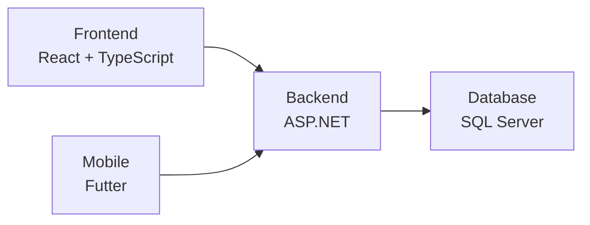

# Room Bookings

## Studi Kasus

- Topik: Sistem Peminjaman Ruangan Kampus
- Bentuk Tugas: Individu
- Target output:
Aplikasi web yang dikembangkan menggunakan ASP.NET sebagai backend, dengan frontend
diutamakan menggunakan React dengan TypeScript. Apabila belum memungkinkan,
frontend dapat menggunakan teknologi standar berupa HTML, CSS, dan JavaScript.

## Latar Belakang

Ruangan kampus digunakan untuk berbagai kegiatan akademik
dan non-akademik. Saat ini pencatatan peminjaman masih
dilakukan secara manual (chat, catatan, spreadsheet), sehingga
pengelolaan data menjadi tidak terpusat.

### Permasalahan yang terjadi

- Data peminjaman mudah tercecer
- tatus peminjaman sulit dipantau
- Riwayat penggunaan ruangan tidak terdokumentasi dengan baik
- Tidak tersedia data rapi untuk evaluasi

## Fitur Utama

1. **Pencatatan peminjaman ruangan**
Sistem mampu mencatat data peminjaman ruangan yang diajukan oleh pengguna.

<u>Cakupan Umum :</u>

- Menambah peminjaman
- Melihat daftar peminjaman
- Melihat detail peminjaman
- Mengubah dan menghapus data peminjaman

2. **Pengelolaan Status Peminjaman**
Setiap peminjaman memiliki status yang menunjukkan kondisi terkini, misalnya menunggu persetujuan, disetujui, ataupun ditolak.

<u>Cakupan Umum :</u>

- Melihat status peminjaman
- Mengubah status peminjaman
- Menyimpan riwayat perubahan

3. **Riwayat dan Penelusuran Peminjaman**
Sistem memungkinkan pengelola untuk menelusuri data peminjaman yang telah tersimpan.

<u>Cakupan Umum :</u>

- Menampilkan riwayat peminjaman
- Pencarian atau filter data peminjaman
- Kriteria pencarian dan teknik implementasi ditentukan oleh mahasiswa

## Arsitektur Sistem

## API Specification

| Method | Endpoint | Description |
| :----: | :---- | :----: |
| GET | /api/room | Get all rooms |
| GET | /api/room/{id} | Get room by id |
| GET | /api/roombooking | Get all booking |
| GET | /api/roombooking/{id} | Get booking by id |
| GET | /api/roombooking/search | Search booking by user name, room or date |
| POST | /api/roombooking | Create new booking |
| PUT | /api/roombooking | Update existing booking |
| DELETE | /api/roombooking | Delete existing booking |
| PUT | /api/roombooking/{id}/status | Change booking status |

## Reflection

Tantangan :

- Handling error di .NET
- Update database via EF core
- Typescript yang susah dipahami
- Handling error di Typescript
- Refactor React agar line code tidak 200 lebih

Solusi :

- Buat global error handling baik di .NET maupun di Typescript
- Dalami lagi materi frontend khususnya react + typescript
- Lebih banyak mengimplementasi try catch
